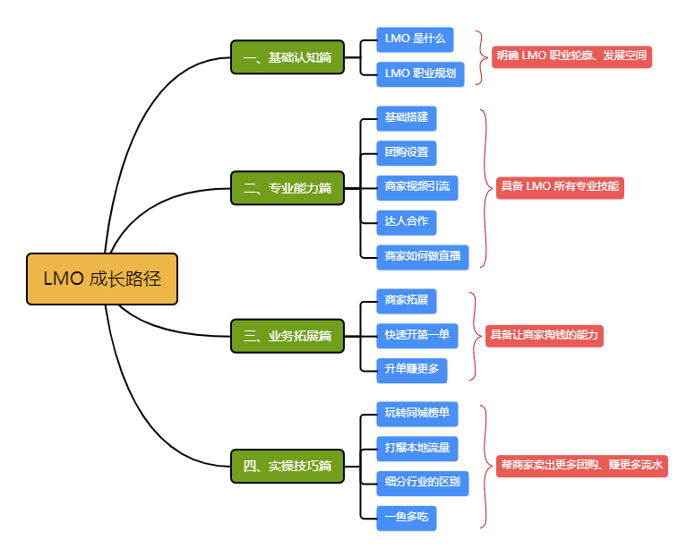

# P01：第一章  本地商家运营师怎么赚钱

## 1 前言

LMO 是突然爆火起来的。

探业类第一大V *名郑言顺* 采访本地商家运营师 *董某萍*：2021 年开始接触本地生活相关业务，纯小白起步，每月除开新签订单，仅管道收益就能达到5w左右。而根据自述，她还远远算不上做得最好的。

采访实拍：某店铺 30 天GMV：54200元，抽成5000多块。

可见，真正用心做，可不是简单赚外快，而是找到了一条全新的职业发展道路。

## 2 LMO 是什么

广义理解：通过一切手段帮助本地商家引流赚钱的人。

专业理解：一个既具备拓展商家的 **销售能力**、又具备帮助商家引流获客的 **运营能力**、并以此获得 **长线收益** 的一个职业。这包含两个角色：

- 角色一：销售——能签约更多商家
- 角色二：运营——能帮商家卖出更多团购、赚流水

## 3 为什么能赚到钱

关键：LMO 是当下的风口

具体原因有四——

1. 商家教育成本低：前期 **团购达人** 的爆火，让商家看到了实实在在的效果，现在很多想做但不会做。如果现在主动帮商家运营线上、帮他卖团购，很多商家都会表示出兴趣，有一定的合作意愿。
2. 市场供不应求：抖音目前有 300w+ 商家，具备商家运营能力的还不足 1000 个，市场红利机会巨大。谋事平台视 LMO 为普通人翻身机会的原因，基于一个常识：**所有的生意中，最好做的永远是做商家或企业的生意**；只要能帮他们赚钱，他们就愿意给你分钱。LMO 的核心在于 **掌握帮商家赚钱的能力**。这项能力的生命周期会很长很长。
3. 平台规则利好：抖音平台的流量规则对商家非常友好。任何一条合规的视频，都会有 300 - 500 的基础播放量，一旦挂了门店地址，就会优先推给周边用户，自然而然帮商家曝光。如果有 100 人发布了与你门店相关的内容，意味着可能有 3w 至 5w 人刷到与你有关的视频，这与传统的线下传单模式有天壤之别。熟练掌握这些规则，并配以一些运营工具及手法，就能帮助商家快速提升流量。
4. 官方风向利好：抖音官方明确表示 2023 年的重点方向，就是在 **电商** 和 **本地生活** 两大板块，也是增长最大的两个版块，可以预见商家运营会得到更多的 **流量扶持**，不会因政策问题影响业务发展。

## 4 为什么是现在

通过抖音官方推出的 **抖音林客** 工具，彻底解决商家不履行分成协议的问题。一旦绑定商家、设置好分佣比例，卖出团购后就能实现自动分佣，再无催款困扰，还能快速对账，省时省心又省力。

商家为什么愿意分佣？

|                 |       对商家而言        |                           |
| :-------------: | :---------------------: | :-----------------------: |
|                 |        **成本**         |         **结果**          |
|   【自己做】    |   时间 / 精力 / 学费    |        不一定学会         |
|   【招人做】    | 工资 10k / 月，12w / 年 |         无法保证          |
| 【交给 LMO 做】 |    有效果才抽佣 10%     | 多卖出 100w，商家多赚 90w |

## 5 怎么做

LMO 成长路径：

除视频课学习外，还提供其他配套服务：

1. 直播老师带班答疑、特训、布置作业
2. 导师团陪跑助力

## 6 小结

希望 **尽快** 进入学习状态，抓住机遇学有所成，在 LMO 这一波流量风口里分一杯羹。

下节课将邀请 LMO 嘉宾（学姐）现身说法，告诉大家新人入行的注意事项。