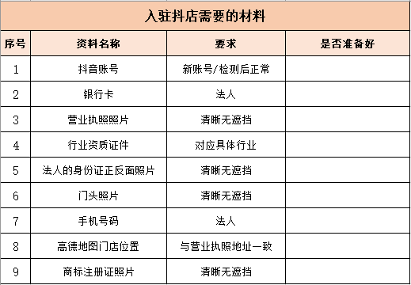

# P03：第三章 如何帮商家在抖音开店（一）——抖音开店

## 1 前言

要成为一名优秀的 LMO，让商家信任你，交给你做运营，肯定需要一些专业技能——

- 如何帮商家入驻抖音？
- 如何给商家组建爆款团购套餐？
- 如何帮商家引流拓客？

本节学习第一项：如何帮商家入驻抖音。

## 2 入驻准备材料

**并非所有行业** 都适合入驻抖音。目前适合入驻的行业主要分为三类：

|        |          行业分类          |                                      |
| :----: | :------------------------: | :----------------------------------: |
|        |       **是否可入驻**       |               **举例**               |
| 第一类 |      可以直接入驻抖音      | 美食、住宿、博物馆、酒吧、美发等行业 |
| 第二类 | 进行报白、通过审核才能入驻 |  攀岩、温泉馆、城市观光、足浴等行业  |
| 第三类 |       明确不可以入驻       |     医疗器械、烟草制品、电子烟等     |

需要准备的资料如下：

1. 抖音账号：建议绑定的是 **法人** 或 **店长** 的号码，也可以新注册一个号（详见注1）；
2. 银行卡：必须是以 **企业法人身份** 开通的银行卡；
3. 营业执照照片：一定要清晰无遮挡、四角齐全；另外，营业执照上的 **经营类目**，必须是在平台的 **招商类目** 范围内，否则无法入驻；
4. 行业资质证件：任何门店开业，都必须要有营业执照；除此之外，有些行业还需要有对应的行业资质证件（详见注2）
5. 法人的身份证正反面照片：要求图片清晰无遮挡，四角齐全
6. 门头照片：包括门店招牌字和门面。照片最好清晰美观，让消费者很容易找到店铺位置
7. 手机号码：一定要是 **法人实名认证** 的手机号
8. 高德地图门店位置：（具体操作详见注3）
   1. 地图已有门店位置：此时需确定地图上的店铺名称和实际的招牌名称是否一致，若不一致则需要修改；
   2. 地图没有门店位置：此时需要在地图上添加地址；
9. 商标注册证照片：在 **多门店认领时** 需要上传，单门店认领则不需要。

注意：

1. （若用员工号，员工离职还需解绑，操作繁琐）；若之前有抖音号，在检测正常后方可使用（【设置】:arrow_right:【反馈与帮助】:arrow_right:【账号状态检测】，若所有项目都是打钩:heavy_check_mark:，则账号正常；否则最好重新注册一个新号）

2. 不同行业的资质证书：（若商家没有资质证书，则需要到当地工商局办理，否则无法通过入驻审核）

   |                      行业                      |                  资质证书                  |
   | :--------------------------------------------: | :----------------------------------------: |
   |                    餐饮行业                    |   《食品经营许可证》或《餐饮服务许可证》   |
   |                  歌舞娱乐行业                  |             《娱乐经营许可证》             |
   |                 住宿、酒店行业                 | 《特种作业许可证》和《公共场所卫生许可证》 |
   |                    美容行业                    |    《卫生许可证》和一名员工的《健康证》    |
   | 高危险性体育项目 (游泳、滑雪、攀岩、潜水等) |       《高危险性体育项目经营许可证》       |

3. 高德地图门店位置操作方法，详见课程资料包（第三章第1节 高德app操作2-如何新增地址.mp4、第三章第1节 高德app操作1-如何修改地址.mp4）

为方便操作，以上九类材料也统一整理放到了课程资料包（第三章第1节 入驻材料-资料表.xls），以便快速对照所需资料是否齐全：

## 3 入驻流程

下载【抖音来客】APP，注册账号并登录首页，点击【入驻抖音门店】；选择【店铺类型】（**认领单店** 或 **认领连锁店**）；

### 一、单店认领

进入对应通道后，在门店搜索页找到自己待认领的门店，按要求上传【企业法人营业执照】、【行业资质补充】（如食品经营许可证）以及【法人实名认证】。然后提交申请。1至3个工作日内就会反馈审核结果，审核通过则代表门店入驻成功。

### 二、连锁店认领

连锁店需在 PC 端操作：

1. 登录商家专属经营平台（https://life.douyin.com），点击【连锁店商家】
2. 按提示提交品牌资质（营业执照、连锁信息（如果没有商标注册证，则点击【上传门头图】，上传至少两张不同连锁店的门头图）、法人身份证）
3. 提交信息，等平台完成审核即可入驻
4. 入驻后需要 **认领连锁门店**：
   1. 在侧边栏【店铺管理】:arrow_right:【门店管理】，点击后边页面中的 **认领门店**，选择门店所在城市、**关键词** 文本框内输入门店名称，点击下一步跳至【提交资质】标签页；
   2. 在【提交资质】页选择营业执照类型（**企业法人营业执照** 或 **个体工商户营业执照**）；
   3. 选择主营类目信息，并提交资质；
   4. 等待平台审核，通过后即完成门店认领；
   5. 重复同样步骤就可认领多家门店了。

### 三、绑定抖音号

如果商家已经在抖音来客入驻、并成功认领门店地址，可以绑定抖音号，获得蓝 V 标志、内容营销、团购推广等权益。

具体流程如下：

1. 打开抖音来客，点击【全部服务】:arrow_right:【抖音号绑定】:arrow_right:【选择待绑企业主体】；
2. 在下方点击“绑定官方抖音号”（若已绑定会直接展示该抖音号）】:arrow_right:【补充新抖音昵称、蓝v认证信息、签名、同意绑定、确认按钮】；
3. 打开被绑定的抖音账号，在【消息】中的 **系统通知** 内是否有绑定申请通知；
4. 若收到通知，需要用对应的抖音号在 24 小时内操作通过确认，确认后就绑定成功了。

## 4 报白

商家自行入驻门店时，可能会出现主营类目 **暂未开放** 的提示，这时就需要走 **报白** 流程。

需要报白的类目有——

- 休闲娱乐：洗浴、足浴、汗蒸、温泉、保健按摩等；
- 文娱行业：滑雪场、城市观光、拓展基地、体检中心等；
- 本地行业：汽车维修、综合商城等；
- 丽人行业：SPA 美体；
- 休闲运动：射击射箭、卡丁车、亲子乐园、攀岩等；

注意：不是所有城市都支持报白，咨询客服得知，可以报白的参考城市（定向招商城市）包括：

上海、杭州、宁波、金华、温州、无锡、南京、苏州、广州、佛山、南昌、深圳、东莞、福州、厦门、泉州、成都、重庆、昆明、北京、天津、青岛、济南、郑州、西安、武汉、合肥、长沙、沈阳、哈尔滨、长春、大连。

另外，2023 年抖音在本地生活版块的动作非常多，不管是报白类目，还是开放城市，一个月里都做出了多次修改。课程更新可能不够及时，最新信息可以直接联系抖音来客的官方客服进行咨询，方法如下：

1. 打开抖音来客，点击右上角的客服图标；
2. 在咨询框内输入“类目报白”；
3. 根据客服提示选择【开白/报白的条件规则咨询？】查看最新报白信息。

## 5 总结

本节介绍：

- 如何从【抖音来客】完成门店入驻？
- 连锁门店如何认领？
- 认领过程中，若找不到地址或地址错误，该怎么解决？
- 如何进行来客帐号和抖音帐号的绑定？

商家入驻抖音后，就要对帐号进行装修。下节将详细介绍。

