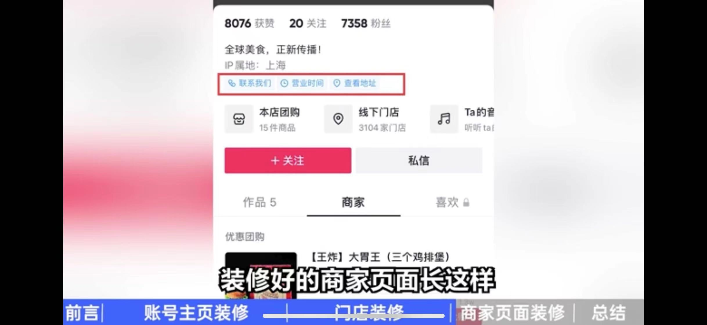

# P04：第三章  如何帮商家在抖音开店（二）——商家账号该怎么装修

## 1 前言

商家入驻抖音后，需要对商家账号进行装修。装修的内容主要包括：

- 主页页面
- 商家页面
- 门店页面

例如：

## 2 账号主页装修

点击 **账号头像** 进入的页面，即账号主页。

主页装修，就是把账号的四要素设置好：**昵称**、**头像**、**背景图**、**简介**。

### 1）设置入口

**未绑定抖音来客**：【我】:arrow_right:【编辑企业资料】

**已绑定抖音来客**：【抖音来客】:arrow_right:【全部服务】:arrow_right:【抖音号绑定】:arrow_right: 选择已经绑定的抖音号 :arrow_right:【编辑资料】

### 2）四要素设置

抖音号绑定来客号后，商家的抖音账号就有了蓝V认证标识。四要素设置需注意——

- 昵称：根据抖音官方规则，昵称要与认证的主体有关（即营业执照上的信息相关）。例如：营业执照是做餐饮的，结果昵称为某某美容馆，是不允许的。除此之外，平台对昵称的限制并不多；
- 头像：最好不要用人物头像（主要目的是打造 **线上店铺**，而 **不是打造个人IP**）；要使用店铺相关的图片做头像（店铺Logo、门头照片、食物照片（餐饮店）、艺术发型头像（美发店）、注重环境的行业如KTV、足浴等，可放店铺环境照片等）；
- 背景图：使用店铺相关的图片做背景图（与头像的做法一致），如店铺Logo、店铺某道菜品、也可以是店铺的环境照、团队成员照片。要保证一定的清晰度，图片大小不超过 5Mb，否则官方会压缩，导致图片变形或模糊。
- 简介：如果需要多行，最多分 4 行，超过会折叠；别人点击进入看不到完整简介。简介是对店铺的介绍，须突出店铺的 **价值** 和 **差异点**。（如杭州臭豆腐小吃店：杭州独一份的“臭”；养发馆：“茶麸洗头，养发护发”）

> **背景图使用小技巧**
>
> 背景图占据很大的区域，以达到 **足够醒目** 的特点。装修时可利用 **醒目** 来引导用户关注。用户关注商家账号后，如果此时商家发了带团购的视频，用户刷到视频的概率就提高了，购买的概率也会相应提高。有一个非常简单且效果明显的做法：在背景图中，直接加入“点击关注”类的引导语。
>
> 引导语类似给观众发出的“行动指令”，不自觉地做出反应关注商家账号。模式很简单：
>
> **背景图 + 引导关注语**
>
> 这里选择的背景图，尽量简单干净一些。可以选择一些纯色或没有复杂图案的图片；引导语除文字外，也可以加上箭头强化。
>
> 引导语的两个常用模板：
>
> 1. 关注我，（怎么怎么样）。例如：
>    1. 关注我，吃杭州最辣的火锅（火锅店）；
>    2. 关注我，带你找回童年（游乐园）
> 2. （想要怎么怎么样），就+关注啊 :arrow_down:。例如：
>    1. 想要变美，就+关注啊 :arrow_down:（美容店）；
>    2. 想要拥有完美体型，就+关注啊 :arrow_down:（健身房）

图片和文字都就绪后，整合图文可以使用【稿定设计】APP 实现，操作也很简单。具体操作详见资料包录制视频（第三章第2节 稿定设计-背景图制作教程.mp4）

## 3 门店主页装修

刷视频时看到的视频下方的 **门店地址**，点击进入的就是 **门店主页**。门店主页的装修通常在 **抖音来客APP** 的【门店管理】及【门店装修】中完成。

操作方法：

通过【抖音来客】:arrow_right:【门店管理】来修改门店信息，主要包括：门店名称、详细地址、营业状态、营业时间、营业电话、门店资质管理等基础信息。展示有效的门店信息，有助于建立用户与商家的联系（包括到店消费）。

点击最下方的【编辑信息】，就可以对上述内容进行修改。

门店的名称、品类、详细地址在认领门店后自动加载，通常不用编辑。

常见信息修改主要是 **门店名称** 的修改（即显示在门店 **左上角** 的店名）。通常在认领时会填写我们的线下门店名；若为加盟店或连锁店，为了与其他门店作区分，让顾客一眼了解是哪个位置的门店，还可以在店名后加个括号写上位置，如：某姐炸串（临平银泰金街店），此时就需要进行编辑。

编辑【营业信息】时——

- 【营业状态】选择【营业中】；
- 【营业时间】如果区分工作日和周末，需要按页面提示分开添加。例如，周一至周五的营业时间是 13:00 至 22:00；周末两天是 10:00 至 22:00，可以分别添加；
- 【营业电话】很多消费者会拨打营业电话进行询问、预约，所以留的电话最好是在店里一直能联系到的电话。因此，如果老板不是经常留在店里的话，不建议填老板的手机号，可以是店里的固话，或专门办一个店里的工作手机号。填写营业电话时，该号码需要接收短信验证码，以完成绑定；
- 编辑完成后，点【提交】等待审核即可（通常一个工作日就会有审核结果）；若审核不通过，按提示进行修改即可。

接下来，点击主页【门店装修】，在基础装修中上传三类图片：

- 外显小图：在抖音搜索店铺时，搜索结果中的左侧店铺头像，就是 **外显小图**。例如搜索 **餐厅**，下方显示的店铺，左侧的头像就是。外显小图建议放店铺的 Logo、环境图、招牌商品。官方相册
- 门店头图：与官方相册中的图片一样，都会显示在 **门店主页上方**。【门店头图】会展示为门店主页的 **背景图**，可以上传展示门店氛围的图片。
- 官方相册：【门店主页】**点击背景图** 或 **往下滑**，就会看到【官方相册】上传的照片。

上传完成后提交审核等待通过即可。对于图片过审的要求，官方客服给出的回复是：

1. 不能带水印：如相机自带的手机型号水印、从其他渠道下载的 APP 的水印等；
2. 不能有马赛克（或明显边框）；
3. 不能出现人物正脸（包括表情标识）；

## 4 商家主页装修

点击账号主页，就可以看到【商家】主页，装修好的商家主页可以展示 **联系方式**、**营业时间**、**查看地址** 等 **企业信息**，以及 **团购、推荐菜** 等 **商家主页信息**，例如：

具体设置在【抖音来客APP】进行——

### 1 设置【企业信息】

1. （抖音号绑定抖音来客后）打开 **抖音来客** APP，在首页找到 **抖音号装修** 进入装修页面。这里可以配置 **展示哪些企业信息**（营业时间、联系电话、查看地址等）、是否开启【商家】页、以及配置【商家】页的 **信息展示顺序** 等；
2. 需要填写某个企业信息，例如 **营业时间**，直接点击进行设置；设置是否展示【营业时间】链接，则需要点击企业信息右上角的【编辑】，通过【营业时间】旁边的开关进行切换显示与隐藏；
3. 企业信息中的【营业时间】、【联系电话】、【查看地址】都设置好并打开展示开关后，待审核通过，就能在抖音账号主页中看到相关超链接。

### 2 设置【商家主页】

最常用的四个设置如下（若想添加其他模块，如 **官网主页**、**店铺活动** 等，可在抖音的【企业服务中心】配置）：

1. 优惠团购：如果有主打套餐，可以进行 **置顶**。单击后，勾选要置顶商品，确认、保存。
2. 门店列表：即展示线下的门店地址。若进行了多门店认领，单击进入后都选上即可。
3. 官方相册：单击，上传图片，填写图片名称即可
4. 推荐菜：单击，上传图片，填写图片名称即可

与【企业信息】的设置一样，以上四个模块也可以通过【编辑】中的 **开关** 来切换显示或隐藏；

编辑状态下，长按最左边的三条横杠图标，还可以设置四个模块的排序。

设置【商家】的显示/隐藏：在 **编辑** 链接的左边还有个 **设置** 超链接，进入后可以设置是否开启【商家】页。设为显示【商家】后，前面设置的 **团购**、**线下门店** 才能在商家账号主页显示，否则都不显示（建议打开，以提高潜在用户的购买率）。

此外，还可以打开【优先展示商家页面】的开关，以便用户进入商家账号后优先看到【商家主页】。

## 5 总结

店铺装修过程中，需要很多图片和照片。门店装修事先需要准备的材料清单已经整理到资料包（详见网盘课程资料：第三章第2节 门店装修准备材料清单.xlsx），以提高操作效率。

课程提到，某些图片不能超过 5Mb，查看图片大小，苹果手机可以在【相册】点开具体图片，单击下方的 :information_source: 图标查看详情。超过 5Mb 的图片可以发送到微信重新保存到相册即可（切记 **不要选原图**）。

对于没有绑定抖音来客 APP 的商家，也可以直接在抖音进行装修。具体方法详见资料包（第三章第2节 抖音APP门店装修.mp4）

无论在【商家】主页还是【门店】主页，**团购** 都是重要的组成部分。这也是本地商家入驻抖音的一大目的。下一节具体介绍团购及团购套餐的设置方法。
